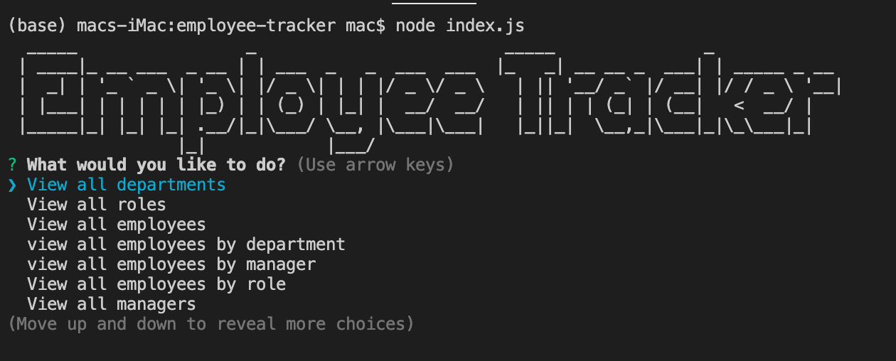
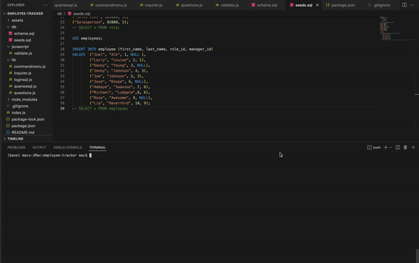

<h1 align="center">Employee-Tracker</h1>
  

   
## Description

🔍 Using node.js application that uses user input from inquirer to populate an employee tracker database displaying members of a company.


  
💻 Below is the gif showing the functionality of the application:
  

  
  
## User Story
  
```
AS A business owner
I WANT to be able to view and manage the departments, roles, and employees in my company
SO THAT I can organize and plan my business
```
  
## Acceptance Criteria
  
``` 
GIVEN a command-line application that accepts user input
WHEN I start the application
THEN I am presented with the following options: view all departments, view all roles, view all employees, add a department, add a role, add an employee, and update an employee role
WHEN I choose to view all departments
THEN I am presented with a formatted table showing department names and department ids
WHEN I choose to view all roles
THEN I am presented with the job title, role id, the department that role belongs to, and the salary for that role
WHEN I choose to view all employees
THEN I am presented with a formatted table showing employee data, including employee ids, first names, last names, job titles, departments, salaries, and managers that the employees report to
WHEN I choose to add a department
THEN I am prompted to enter the name of the department and that department is added to the database
WHEN I choose to add a role
THEN I am prompted to enter the name, salary, and department for the role and that role is added to the database
WHEN I choose to add an employee
THEN I am prompted to enter the employee’s first name, last name, role, and manager and that employee is added to the database
WHEN I choose to update an employee role
THEN I am prompted to select an employee to update and their new role and this information is updated in the database 
```
  
## Table of Contents
- [Description](#description)
- [User Story](#user-story)
- [Acceptance Criteria](#acceptance-criteria)
- [Table of Contents](#table-of-contents)
- [Installation](#installation)
- [Usage](#usage)
- [Testing](#testing)
- [Contributing](#contributing)
- [Questions](#questions)

## Installation
💾   
  
`npm init`
  
`npm install inquirer`

`npm install mysql2`

`npm install console-table`

`npm install figlet`

`npm install chalk`

`npm install nodemon`

`npm install validator`
  
## Usage
💻   
  
Run the following command at the root of your project and answer the prompted questions:
  
`npm start`

## Testing
✏️

No testing is currently set up

## Contributing
:octocat: [Tri Nguyen](https://github.com/tringuyen128)

